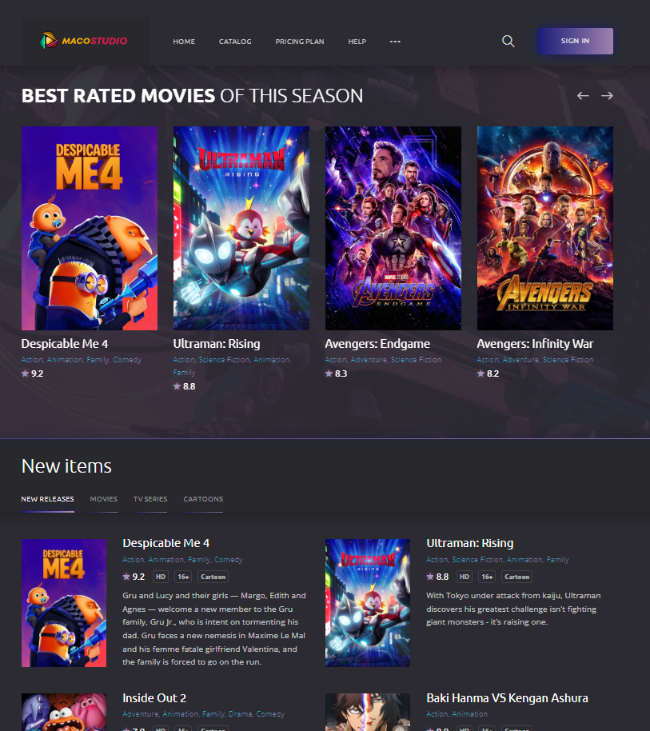
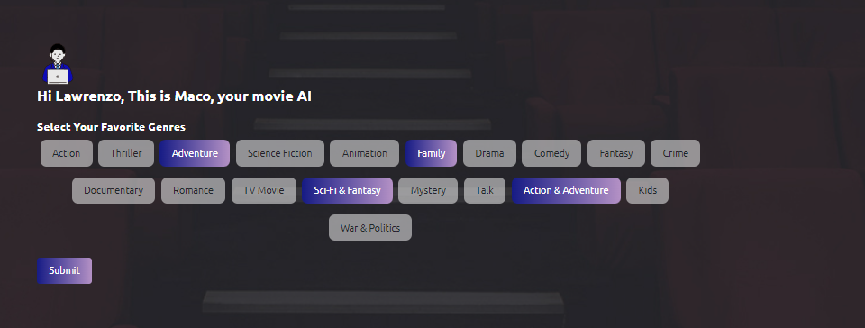
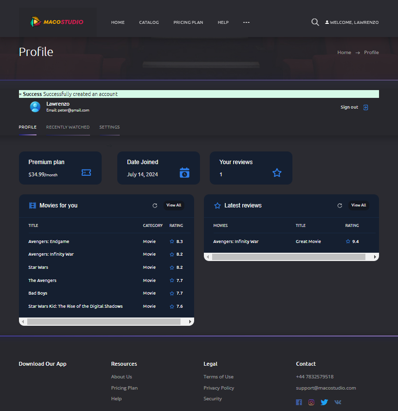
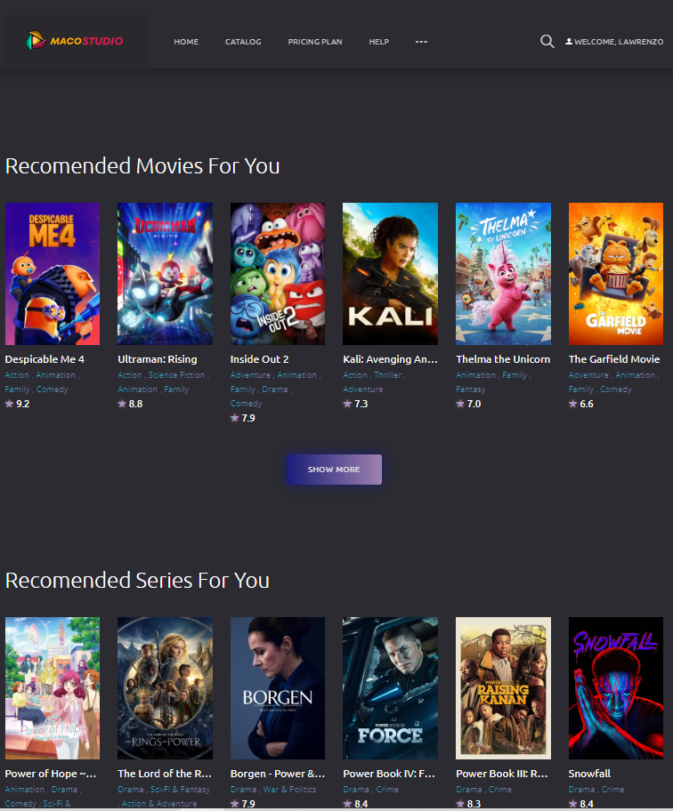
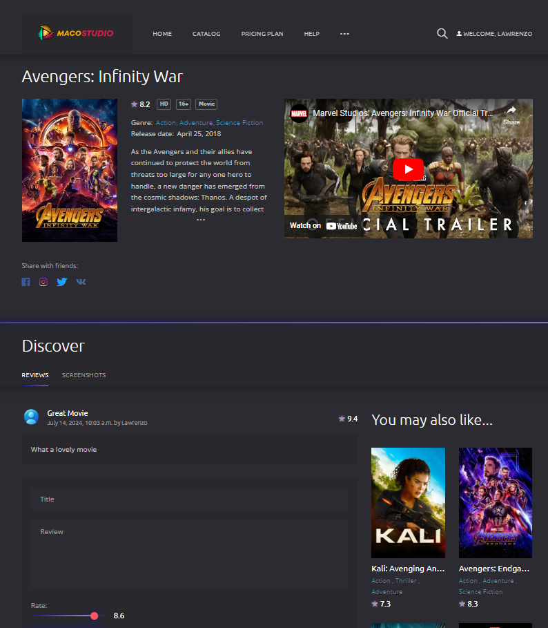

# macostudios

macostudios is an intelligent movie and series recommendation app that uses AI to display users' favorite movies and series based on their choices. The app is built primarily with Django and utilizes a PostgreSQL database.

## Features

- **AI-Powered Recommendations**: Uses AI algorithms to recommend movies and series tailored to each user’s preferences.
- **User-Friendly Interface**: Intuitive design for seamless navigation and interaction.
- **Personalized Profiles**: Each user has a personalized profile page showcasing their favorite movies and series.
- **Extensive Database**: Utilizes a robust PostgreSQL database to manage and store user data and movie/series information.
- **TMDB API Integration**: Fetches detailed information about movies and series using the TMDB API.
- **YouTube API Integration**: Fetches related videos and trailers using the YouTube API.

## Screenshots

Here are some screenshots of the app in action:


*Home Page*


*AI Page*


*Profile Page*


*Recommendations*


*Movies*

## Technologies Used

- **Backend**: Django
- **Database**: PostgreSQL
- **Frontend**: HTML, CSS, JavaScript
- **AI Algorithms**: Python (specific libraries and models used can be listed here if applicable)
- **APIs**: 
  - [TMDB API](https://www.themoviedb.org/documentation/api)
  - [YouTube API](https://developers.google.com/youtube/v3)

## Getting Started

### Prerequisites

Make sure you have the following installed:

- Python 3.8+
- Django 3.2+
- PostgreSQL 12+

### Installation

1. **Clone the repository:**

```bash
git clone https://github.com/Lawrence496/macostudios.git
cd macostudios
```

2. **Create a virtual environment and activate it:**

```bash
python -m venv venv
source venv/bin/activate
```

3. **Install the required packages:**

```bash
pip install -r requirements.txt
```

4. **Configure the PostgreSQL database:**

   Update the `DATABASES` settings in `macostudios/settings.py` to match your PostgreSQL configuration.

```python
DATABASES = {
    'default': {
        'ENGINE': 'django.db.backends.postgresql',
        'NAME': 'your_db_name',
        'USER': 'your_db_user',
        'PASSWORD': 'your_db_password',
        'HOST': 'your_db_host',
        'PORT': 'your_db_port',
    }
}
```

5. **Set up the TMDB and YouTube API keys:**

   Add your API keys to the `settings.py` file.

```python
TMDB_API_KEY = 'your_tmdb_api_key'
YOUTUBE_API_KEY = 'your_youtube_api_key'
```

6. **Apply migrations:**

```bash
python manage.py migrate
```

7. **Run the development server:**

```bash
python manage.py runserver
```

Open your browser and navigate to `http://127.0.0.1:8000` to see the app in action.

## Usage

1. **Sign Up/Login**: Create an account or log in to your existing account.
2. **Set Preferences**: Choose your favorite genres, actors, and directors.
3. **Get Recommendations**: View personalized movie and series recommendations on your profile page.
4. **Explore**: Browse through the extensive collection of movies and series.

## Contributing

We welcome contributions! Please follow these steps:

1. Fork the repository.
2. Create a new branch (`git checkout -b feature-branch`).
3. Commit your changes (`git commit -m 'Add some feature'`).
4. Push to the branch (`git push origin feature-branch`).
5. Open a Pull Request.

## License

This project is licensed under the MIT License - see the LICENSE file for details.

## Acknowledgments

- Inspired by various AI and movie recommendation projects.
- Uses data from [TMDB API](https://www.themoviedb.org/documentation/api) and videos from [YouTube API](https://developers.google.com/youtube/v3).

---
